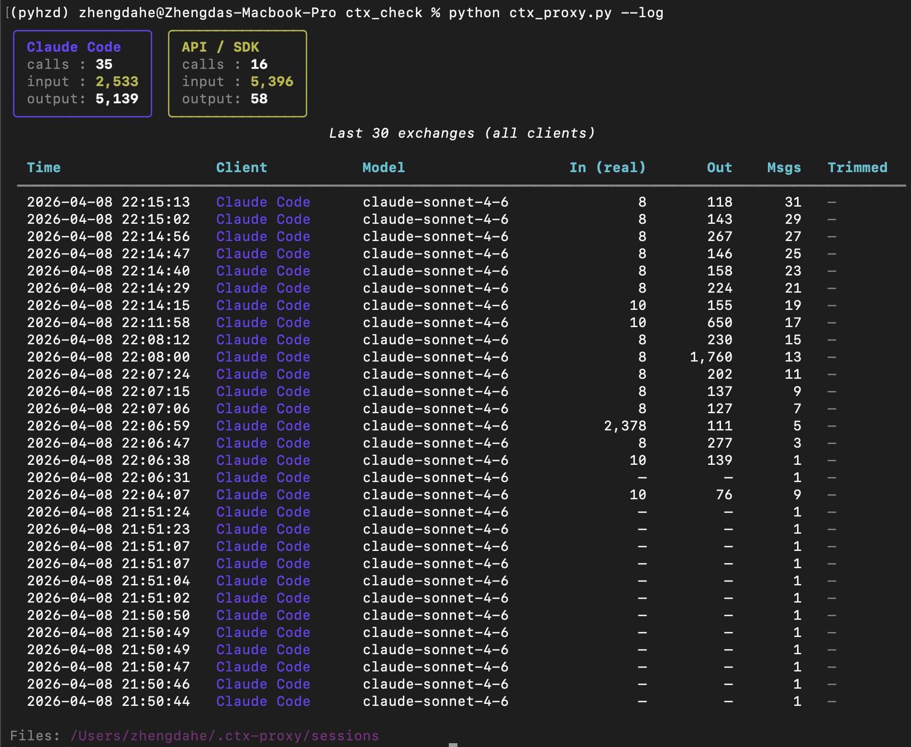

# ctx-proxy

A transparent proxy that sits between **Claude Code** and `api.anthropic.com`. It logs every request and response, reports token usage and cost, and optionally lets you inspect and trim the context window before each API call.

## How it works

```
Claude Code  →  http://localhost:7899  →  api.anthropic.com
                     ctx-proxy
                  (logs everything)
```

Set `ANTHROPIC_BASE_URL=http://localhost:7899` and Claude Code routes all API traffic through the proxy. Requests are forwarded unchanged in passthrough mode; in interactive mode the proxy pauses so you can drop or trim messages before they are sent.



*`--logs` view: separates **Claude Code** IDE traffic from direct **API / SDK** calls, showing real input/output token counts and message depth for each request in the current session.*

## Requirements

- Python 3.8+
- `rich` (optional, but recommended for the pretty TUI):  `pip install rich`

## Quick start

```bash
# Start the proxy daemon in the background
python ctx_proxy.py --start

# Point Claude Code at it (add to ~/.claude/settings.json or export in shell)
# "env": { "ANTHROPIC_BASE_URL": "http://localhost:7899" }

# Check it's running
python ctx_proxy.py --status

# See what it has logged so far
python ctx_proxy.py --logs
```

To stop:

```bash
python ctx_proxy.py --stop
```

## CLI reference

| Command | Description |
|---------|-------------|
| `--start` | Start background daemon (default port 7899) |
| `--stop` | Stop the running daemon |
| `--status` | Print daemon PID and uptime |
| `--interactive` | Start in interactive mode — pauses before each request |
| `--logs [-n N]` | Show the N most recent logged requests (default 30) |
| `--today [--plan KEY]` | Today's token usage vs plan limits |
| `--weekly [--plan KEY]` | This week's token usage vs plan limits |
| `--inspect [N]` | Show full input + output of exchange #N (1 = most recent). Omit N to list recent exchanges. |
| `--analyze FILE` | Analyse a saved `.jsonl` or `.json` session file |
| `--cost [--since PERIOD] [--mode MODE] [--by GROUP]` | Cost report |
| `--setup` | Print instructions for connecting Claude Code |
| `--remove` | Print instructions for full removal |
| `--port / -p PORT` | Override the proxy port (default: 7899) |

## Interactive mode

> **Warning:** only use this in a dedicated terminal session. Claude Code makes background API calls constantly — each one will block waiting for your input.

```bash
python ctx_proxy.py --interactive
```

When a request arrives you see a token breakdown and a prompt:

```
Commands:  s=send  d <n>=drop msg  t <n>=trim msg  r=re-show  j=save JSON  x=abort
```

| Command | Effect |
|---------|--------|
| `s` or Enter | Forward the request (with any edits applied) |
| `d <n>` | Drop message at index n |
| `t <n>` | Replace message n with custom text |
| `r` | Re-display the current context analysis |
| `j` | Save the full JSON payload to disk |
| `x` | Abort the request (returns an error to Claude Code) |

## Inspecting exchanges

`--inspect` lets you read the actual text content of any logged exchange — the full system prompt, every input message, and the assistant's response.

```bash
# List recent exchanges with index numbers
python ctx_proxy.py --inspect

# View the most recent exchange in full
python ctx_proxy.py --inspect 1

# View the 5th most recent exchange
python ctx_proxy.py --inspect 5
```

Each exchange shows:
- **System prompt** — the full system instructions sent to the model
- **Input messages** — every message in the conversation, with role, token count, and full text
- **Response** — the assistant's complete output

Long messages are truncated at 4 000 characters in the display. Use `--analyze FILE` on the raw `.jsonl` file for untruncated access.

## Cost tracking

The proxy computes USD cost for every request using a built-in price table (last verified 2026-04-08). The table covers all current Claude models including cache write (5 min / 1 h) and cache read pricing.

To override prices, create `~/.ctx-proxy/prices.json` with the same schema as `DEFAULT_PRICES` in `ctx_proxy.py`.

```bash
# Spending this month
python ctx_proxy.py --cost --since month

# Group by day
python ctx_proxy.py --cost --since week --by day

# Filter to oauth or api_key sessions only
python ctx_proxy.py --cost --mode oauth
```

## File layout

```
~/.ctx-proxy/
├── proxy.pid          # daemon PID
├── proxy.log          # daemon stderr
├── config.json        # port override
├── prices.json        # optional price override
└── sessions/
    └── claude_code_YYYY-MM-DD.jsonl   # one entry per request
```

Each `.jsonl` entry contains: timestamp, model, request payload, response payload (merged from SSE if streaming), usage dict, and computed cost.

## Claude Code setup

Add to `~/.claude/settings.json`:

```json
{
  "env": {
    "ANTHROPIC_BASE_URL": "http://localhost:7899"
  }
}
```

Run `python ctx_proxy.py --setup` for the full instructions including how to verify the proxy is receiving traffic.

## Removal

Run `python ctx_proxy.py --remove` for the full removal steps (stops daemon, removes `~/.ctx-proxy/`, reverts `settings.json`).
